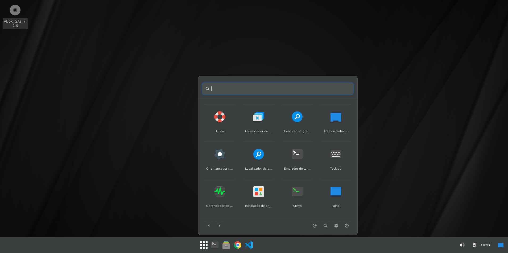

# 🚀 labs-launcher

Um menu de aplicativos minimalista, moderno e performante, projetado especificamente para o painel do **XFCE**. Este plugin oferece uma interface limpa, inspirada em designs contemporâneos, com foco em usabilidade e estética.



## ✨ Funcionalidades

- 📱 **Grade de Apps**: Visualização moderna em grade para seus aplicativos.
- 🔍 **Busca Inteligente**: Pesquise instantaneamente por nome de aplicativos.
- 📂 **Paginação**: Navegação suave entre páginas com indicadores visuais.
- 🎨 **Design Moderno**: Interface dark-mode com cantos arredondados e efeitos de hover.
- ⚙️ **Integração XFCE**: Acesso rápido às Configurações do Sistema e Logout.
- ⚡ **Leve e Rápido**: Escrito em C puro utilizando GTK+ 3.

## 🛠️ Tecnologias

- **Linguagem**: C
- **Interface**: GTK+ 3.0
- **Framework de Painel**: Libxfce4panel-2.0

## 🚀 Instalação

### Pré-requisitos (Ubuntu/Debian/Xubuntu)

```bash
sudo apt update
sudo apt install build-essential libxfce4panel-2.0-dev libxfce4ui-2-dev libxfce4util-dev libgtk-3-dev pkg-config
```

### Compilando e Instalando

1. Clone o repositório:
   ```bash
   git clone https://github.com/ThiagoAciole/labs-launcher.git
   cd labs-launcher
   ```

2. Compile o projeto:
   ```bash
   make
   ```

3. Instale o plugin:
   ```bash
   sudo make install
   ```

4. Reinicie o painel do XFCE para aplicar as alterações:
   ```bash
   xfce4-panel -r
   ```

5. Adicione ao painel: Clique com o botão direito no painel -> **Painel** -> **Adicionar novos itens** -> Procure por **Labs Launcher**.

## 📁 Estrutura do Projeto

- `src/`: Código-fonte em C.
- `data/`: Arquivos de configuração e ícones.
- `Makefile`: Script de automação de compilação e instalação.

## 🤝 Contribuindo

Sinta-se à vontade para abrir **Issues** ou enviar **Pull Requests**. Toda contribuição para melhorar este launcher é bem-vinda!

---

Desenvolvido por [Thiago Aciole](https://github.com/ThiagoAciole)

